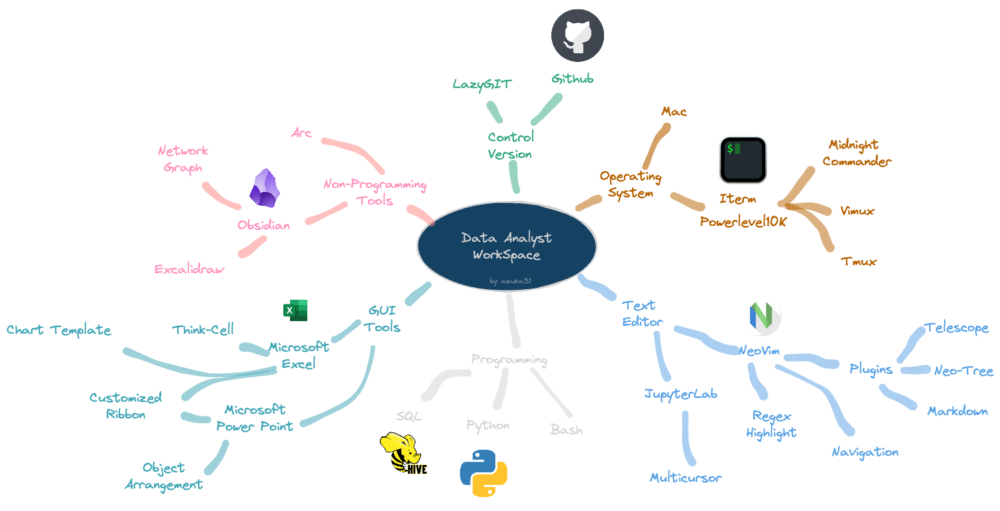

# AzukaWorkspace

## List of Contents

|Key Aspects | Tools| Repository | Notes|
|---|---|---|---|
|Programming |Bash|Fuzzyfinder; eza; bat|
||Python|Plotly; Pandas; |
||SQL||
|Operating System|MacOS|
||ITerm|Powerlevel10K; Midnight Commander; Tmux; Brew
|Text Editor|NeoVim|Telescope; NeoTree; Markdown Preview|
||JupyterLab||
|Gui Tools|Microsoft Excel|Toolbars; Chart Template|
||Microsoft Power Point|Objects|
||Think-Cell|
|Non-Programming Tools|Obsidian|
||Excalidraw|
|Control Version|LazyGit|

